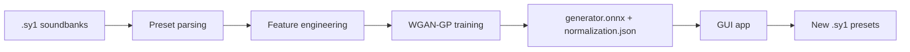

# Synth1GAN — This Synth1 Bank Does Not Exist

Generates novel presets for the [Synth1](https://daichilab.sakura.ne.jp/softsynth/) VST synthesizer using a **WGAN-GP** neural network trained on real soundbanks.

<div class="grid cards" markdown>

-   :material-download: **Download**

    ---

    Get the app for your platform:

    [Windows](https://github.com/seechov/synth1-patch-generator/releases/latest){ .md-button }
    [macOS](https://github.com/seechov/synth1-patch-generator/releases/latest){ .md-button }
    [Linux (.deb / .rpm)](https://github.com/seechov/synth1-patch-generator/releases/latest){ .md-button }

-   :material-book-open-page-variant: **Learn**

    ---

    Read the [overview](overview.md), or jump straight to
    [training your own model](overview.md#41-training-the-model).

-   :material-console: **Build from source**

    ---

    The [Training](https://github.com/seechov/synth1-patch-generator/tree/main/training) part is Python 3.12 / PyTorch, and the
    [GUI](https://github.com/seechov/synth1-patch-generator/tree/main/gui) is Rust / egui / tract-onnx.

</div>

---

## What is Synth1GAN?

Synth1GAN generates new, previously non-existent presets (`.sy1`) for the free **Synth1** VST synth. It is a Wasserstein GAN with Gradient Penalty (WGAN-GP) trained on the factory bank, free soundbanks, or any combination. The training code is based on the original [jskripchuk/Synth1GAN](https://github.com/jskripchuk/Synth1GAN) project (GPL-3.0).

The whole pipeline:



---

## Quick start

### Generate presets

1. Download and launch the app for your platform.
2. On first launch the bundled default model loads automatically — you should see a green **● model ready** indicator.
3. Pick an **Output folder** (defaults to `Documents/Synth1GAN/presets`).
4. Set a bank name and preset count (1–128).
5. Click **⚡ Generate**.
6. Load the output folder into Synth1 via **File → Load Bank**.

### Train your own model

```powershell
# GPU (CUDA 12.1) — recommended
pip install torch torchvision --index-url https://download.pytorch.org/whl/cu121

pip install -r training/requirements.txt
python training/train.py --presets-dir C:\path\to\presets --output-dir .\model
```

> GPU is strongly recommended (~8 h on GTX 1070, ~30 min on RTX 3080). Training is supported on Python 3.12.

See the [overview](overview.md) for full details.
