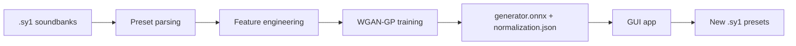

# Synth1GAN — Project Overview

> **This Synth1 Bank Does Not Exist** — generates new presets for the [Synth1](https://daichilab.sakura.ne.jp/softsynth/) VST synthesizer using a WGAN-GP neural network.

---

## 1. About the project

Synth1GAN generates new, previously non-existent presets (`.sy1`) for the free **Synth1** VST synthesizer. It is based on a Wasserstein GAN with Gradient Penalty (WGAN-GP), trained on real soundbanks.

The project consists of two independent parts:

| Part | Language | Purpose |
|------|----------|---------|
| **Training** (`training/`) | Python 3.12 / PyTorch | Preset parsing, data preparation, model training, ONNX export |
| **Generation** (`gui/`) | Rust / egui / tract-onnx | Cross-platform app for generating presets from the trained model |

The overall workflow:



---

## 2. Repository structure

```
Synth1GAN/
├── training/                  # Python: preset parsing and model training
│   ├── train.py               # All-in-one training script (the whole pipeline)
│   ├── requirements.txt       # Python dependencies (PyTorch installed separately)
│   ├── TRAIN_EXPLAINED.md     # Detailed training walkthrough (English)
│   ├── TRAIN_EXPLAINED_ru.md  # Detailed training walkthrough (Russian)
│   └── model/                 # Training output (in .gitignore)
├── gui/                       # Rust: cross-platform GUI
│   ├── Cargo.toml             # Manifest and dependencies
│   ├── Cargo.lock             # Locked dependency versions
│   ├── src/main.rs            # All GUI logic (single file)
│   └── assets/
│       └── synth1gan.desktop  # .desktop file for Linux
├── installer/                 # Packaging configs
│   ├── windows/setup.iss      # Inno Setup script (Windows installer)
│   ├── macos/Info.plist       # macOS .app bundle metadata
│   └── trained-model/         # Default model for the installers
│       ├── generator.onnx     # Exported generator
│       └── normalization.json # Normalization metadata
├── presets/                   # Input/output presets (in .gitignore)
├── docs/
│   ├── overview.md                 # This document
│   ├── overview_ru.md              # Russian version of this document
│   ├── training-improvements.md    # Training-methodology improvement plan
│   └── training-improvements_ru.md # Russian version of the improvement plan
├── .devcontainer/             # DevContainer for Zed / VS Code
│   ├── Dockerfile             # Python 3.11 + system dependencies
│   └── devcontainer.json      # Environment configuration
├── .github/workflows/
│   └── release.yml            # CI release builds (Windows/Linux/macOS)
├── .zed/settings.json         # Zed editor settings
├── .gitignore
├── LICENSE                    # MIT (Copyright © 2026 Aleksei Sychev)
├── README.md                  # Quick start and instructions
└── README_ru.md               # Quick start and instructions (Russian)
```

---

## 3. How it works

### 3.1 Training stage (`training/train.py`)

The script runs the whole pipeline in 5 steps:

1. **Loading** — recursively find `.sy1` files and parse them into dictionaries.
2. **Dataset building** — convert presets into a `DataFrame`, renaming numeric parameter IDs to human-readable names.
3. **Feature engineering** — drop noisy/sparse parameters and one-hot encode categorical features (logging the number of dropped columns/rows).
4. **Normalization** — scale *only continuous* parameters into `[-1, 1]` (for the `Tanh` output layer); one-hot features stay in `[0, 1]`.
5. **Training and export** — train the WGAN-GP, export the EMA version of the generator to ONNX, and save normalization metadata.

#### Synth1 parameters

A Synth1 preset is described by a set of parameters mapped through `COL_RENAME` (e.g. `filter freq`, `amp attack`, `lfo1 speed`). During preparation:

- **Training** uses two groups of features: continuous parameters + one-hot encoded categories (their number depends on the dataset).
- Some parameters are **excluded from training** (arpeggiator, equalizer, pitch bend, and others) as too noisy or sparse.
- Categorical variables (oscillator shapes, filter types, LFO destinations, etc.) are handled with `scikit-learn`'s `OneHotEncoder`.
- Continuous features are scaled to `[-1, 1]`; one-hot features stay `0/1`.

### 3.2 Model architecture

| Component | Architecture |
|-----------|--------------|
| **Generator** | noise(N) → shared trunk (128→256→512→1024, BatchNorm + LeakyReLU) → a `Tanh` head for continuous features + a `softmax` head per categorical variable |
| **Discriminator** | preset(F) → Linear(256) → Linear(128) → Linear(64) → Linear(1), LeakyReLU(0.2), optional spectral normalization |
| **Training** | WGAN-GP, gradient penalty λ=10, 5 critic steps per generator step, Adam lr_g/lr_d (β₁=0.5, β₂=0.999), EMA of the generator weights |

### 3.3 Training output

After successful training, a model directory is created:

```
model/
├── generator.onnx        ← loaded by the GUI app
├── normalization.json    ← normalization metadata (min/max, one-hot encodings)
└── checkpoints/          ← periodic weight snapshots (every 500 epochs)
```

`normalization.json` describes how to map the generator output back to real parameter values: continuous parameters are denormalized from `[-1, 1]` to `[min, max]`, categoricals are recovered via `argmax` over a one-hot slice (the output of a softmax head).

### 3.4 Generation stage (`gui/src/main.rs`)

The GUI is written in Rust using:

- **[eframe/egui](https://github.com/emilk/egui)** — native cross-platform UI.
- **[tract-onnx](https://github.com/sonos/tract)** — pure-Rust ONNX runtime, no external DLLs.
- **rfd** — native folder-picker dialogs.
- **rand / rand_distr** — normal noise generation for the generator input.

Generation process:

1. On startup the app looks for a default model next to the executable (a `model/` directory next to the exe/binary, or `/usr/share/synth1gan/model` on Linux). If `generator.onnx` and `normalization.json` are found, the model loads automatically.
2. The default output folder is `Documents/Synth1GAN/presets` (created if needed).
3. On **⚡ Generate**, for each of `N` presets:
   - a latent noise vector is generated (normal distribution);
   - the model emits a vector where continuous parameters come first, then one-hot groups (each the result of a softmax head);
   - the output is decoded back into a `param_id → value` map;
   - a `.sy1` file is written (header + sorted parameters).
4. The resulting presets are loaded into Synth1 via **File → Load Bank**.

> If the app has no default model, point it to a folder containing `generator.onnx` + `normalization.json` and load it with **Load model**.

---

## 4. Usage

### 4.1 Training the model

Python 3.12 is required. PyTorch is installed separately (GPU via CUDA 12.1, or CPU). Training is supported on Python 3.12; newer versions may not work.

```powershell
# GPU (CUDA 12.1)
pip install torch torchvision --index-url https://download.pytorch.org/whl/cu121

# CPU
pip install torch torchvision --index-url https://download.pytorch.org/whl/cpu
```

Then install dependencies and run:

```powershell
pip install -r training/requirements.txt
python training/train.py --presets-dir C:\path\to\presets --output-dir .\model
```

Main options:

| Option | Default | Description |
|--------|---------|-------------|
| `--epochs` | 20000 | Number of epochs (diminishing returns after ~10k) |
| `--batch-size` | 64 | Auto-clamped if it exceeds the dataset size |
| `--latent-dim` | 32 | Latent noise vector size |
| `--lr-g` | 0.0002 | Generator learning rate |
| `--lr-d` | 0.0002 | Discriminator learning rate |
| `--n-critic` | 5 | Discriminator steps per generator step |
| `--lambda-gp` | 10.0 | Gradient penalty weight |
| `--ema-decay` | 0.999 | EMA decay for generator weights (`0` disables) |
| `--spectral-norm` | off | Spectral normalization in the discriminator |
| `--d-noise-std` | 0.0 | Std of Gaussian noise added to discriminator inputs |
| `--seed` | — | Random seed for reproducibility |

> GPU is strongly recommended (~8 h on GTX 1070, ~30 min on RTX 3080).

### 4.2 Building the GUI

```powershell
cd gui
cargo build --release
```

Binaries: `gui\target\release\synth1gan.exe` (Windows) or `gui/target/release/synth1gan` (Linux).

### 4.3 Generating presets

1. Launch the app — if a model ships with the installer it loads automatically and shows a "● model ready" indicator.
2. If needed, load a different model folder (containing `generator.onnx` + `normalization.json`) with **Load model**.
3. Pick an output folder (defaults to `Documents/Synth1GAN/presets`).
4. Set a bank name and preset count (1–128).
5. Click **⚡ Generate**.

---

## 5. Build and CI/CD

### 5.1 Local development (DevContainer)

The repository ships a DevContainer config (`.devcontainer/`) that Zed and VS Code auto-detect. The container includes Python 3.11, PyTorch (CPU build), and the full Rust toolchain (rust-analyzer, rustfmt, clippy).

> For GPU training, run `train.py` natively on Windows — GPU passthrough in Docker requires WSL2 + NVIDIA Container Toolkit.

### 5.2 Automatic release builds

`.github/workflows/release.yml` builds artifacts when a version tag (e.g. `v1.0.0`) is pushed:

| Job | Platform | Result |
|-----|----------|--------|
| `build-windows` | `windows-latest` | `.exe` installer (Inno Setup) |
| `build-linux` | `ubuntu-22.04` | `.deb` (cargo-deb) and `.rpm` (cargo-generate-rpm) packages |
| `build-macos` | `macos-latest` | `.app` bundle and `.dmg` (hdiutil) |

All artifacts are uploaded to a GitHub Release via `softprops/action-gh-release`.

### 5.3 Packaging

- **Windows** — `installer/windows/setup.iss` (Inno Setup, EN/RU localization). The default model (`installer/trained-model/`) is packaged into a `model/` directory next to the executable.
- **macOS** — `installer/macos/Info.plist` (identifier `com.seechov.synth1gan`). The model is placed in `Contents/MacOS/model/` inside the `.app` bundle.
- **Linux** — `gui/assets/synth1gan.desktop` + `cargo-deb`/`cargo-generate-rpm` metadata in `Cargo.toml`. The model is packaged into `/usr/share/synth1gan/model`.

---

## 6. License and authorship

- **GUI and project code**: MIT (see `LICENSE`, Copyright © 2026 Aleksei Sychev).
- **Training code** (`training/`): **GPL-3.0**, derived from the original [jskripchuk/Synth1GAN](https://github.com/jskripchuk/Synth1GAN) project (see `training/LICENSE`).
- **GUI author**: Aleksei Sychev `seechov@protonmail.com` (see `gui/Cargo.toml`).
- **Synth1** — VST synthesizer by Daichi Laboratory (ICHIRO TODA), see <https://daichilab.sakura.ne.jp/softsynth/>.

---

## 7. Useful links

- [Synth1 (official site)](https://daichilab.sakura.ne.jp/softsynth/)
- [tract-onnx — Rust ONNX runtime](https://github.com/sonos/tract)
- [egui — Rust GUI library](https://github.com/emilk/egui)
- [PyTorch — install for your platform](https://pytorch.org/get-started/locally/)
- Detailed training walkthrough: `training/TRAIN_EXPLAINED.md` and `training/TRAIN_EXPLAINED_ru.md`
