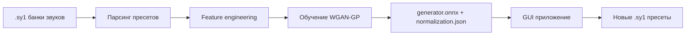

# Synth1GAN — Project Overview

> **This Synth1 Bank Does Not Exist** — генерация новых пресетов для VST-синтезатора [Synth1](https://www.taktech.org/takumi/synth1/) с помощью нейросети WGAN-GP.

---

## 1. О проекте

Synth1GAN генерирует новые, ранее не существовавшие пресеты (`.sy1`) для бесплатного VST-синтезатора **Synth1**. В основе лежит генеративно-состязательная сеть с градиентным штрафом (Wasserstein GAN with Gradient Penalty, WGAN-GP), обученная на реальных банках звуков.

Проект состоит из двух независимых частей:

| Часть | Язык | Назначение |
|-------|------|------------|
| **Обучение** (`training/`) | Python 3.11+ / PyTorch | Парсинг пресетов, подготовка данных, обучение модели, экспорт в ONNX |
| **Генерация** (`gui/`) | Rust / egui / tract-onnx | Кроссплатформенное приложение для генерации пресетов из обученной модели |

Итоговый рабочий цикл:



---

## 2. Структура репозитория

```
Synth1GAN/
├── training/                  # Python: парсинг пресетов и обучение модели
│   ├── train.py               # Единый скрипт обучения (весь пайплайн)
│   ├── requirements.txt       # Python-зависимости (PyTorch ставится отдельно)
│   ├── TRAIN_EXPLAINED_en.md  # Подробное объяснение обучения (англ.)
│   ├── TRAIN_EXPLAINED_ru.md  # Подробное объяснение обучения (рус.)
│   ├── training.log           # Лог последнего запуска обучения
│   └── model/                 # Результаты обучения (в .gitignore)
├── gui/                       # Rust: кроссплатформенное GUI
│   ├── Cargo.toml             # Манифест и зависимости
│   ├── Cargo.lock             # Зафиксированные версии зависимостей
│   ├── src/main.rs            # Вся логика GUI (один файл)
│   └── assets/
│       └── synth1gan.desktop  # .desktop-файл для Linux
├── installer/                 # Конфигурации упаковки
│   ├── windows/setup.iss      # Сценарий Inno Setup (Windows-инсталлятор)
│   ├── macos/Info.plist       # Метаданные macOS .app-бандла
│   └── trained-model/         # Модель по умолчанию для инсталлятора
│       ├── generator.onnx     # Экспортированный генератор
│       └── normalization.json # Метаданные нормализации
├── presets/                   # Входные/выходные пресеты (в .gitignore)
├── docs/
│   └── overview.md            # Этот документ
├── .devcontainer/             # DevContainer для Zed / VS Code
│   ├── Dockerfile             # Python 3.11 + системные зависимости
│   └── devcontainer.json      # Конфигурация окружения
├── .github/workflows/
│   └── release.yml            # CI-сборка релизов (Windows/Linux/macOS)
├── .zed/settings.json         # Настройки редактора Zed
├── .gitignore
├── LICENSE                    # MIT (Copyright © 2026 Seechov)
└── README.md                  # Быстрый старт и инструкции
```

---

## 3. Как это работает

### 3.1 Этап обучения (`training/train.py`)

Скрипт выполняет весь пайплайн за 5 шагов:

1. **Загрузка** — рекурсивный поиск `.sy1`-файлов и их парсинг в словари.
2. **Построение датасета** — преобразование пресетов в `DataFrame`, переименование числовых идентификаторов параметров в человекочитаемые имена.
3. **Feature engineering** — удаление шумных/разреженных параметров и one-hot кодирование категориальных признаков.
4. **Нормализация** — масштабирование всех значений в диапазон `[-1, 1]` (под выходной слой `Tanh`).
5. **Обучение и экспорт** — обучение WGAN-GP, экспорт генератора в ONNX и сохранение метаданных нормализации.

#### Параметры Synth1

Пресет Synth1 описывается набором параметров, сопоставленных через `COL_RENAME` (например, `filter freq`, `amp attack`, `lfo1 speed`). В ходе подготовки:

- **Обучение** использует **105 признаков**: 51 непрерывный параметр + 54 one-hot закодированных признака (10 категориальных параметров).
- Часть параметров **исключается из обучения** (арпеджиатор, эквалайзер, pitch bend и другие) как слишком шумные или разреженные.
- Категориальные переменные (формы осцилляторов, типы фильтров, назначения LFO и т.д.) обрабатываются через `scikit-learn` `OneHotEncoder`.

### 3.2 Архитектура модели

| Компонент | Архитектура |
|-----------|-------------|
| **Generator** | noise(10) → Linear(128) → Linear(256) → Linear(512) → Linear(1024) → Linear(105), BatchNorm + LeakyReLU(0.2), выход `Tanh` |
| **Discriminator** | preset(105) → Linear(256) → Linear(128) → Linear(64) → Linear(1), LeakyReLU(0.2) |
| **Обучение** | WGAN-GP, градиентный штраф λ=10, 5 шагов критика на 1 шаг генератора, Adam lr=0.0002 (β₁=0.5, β₂=0.999) |

### 3.3 Результаты обучения

После успешного обучения создаётся директория модели:

```
model/
├── generator.onnx        ← загружается GUI-приложением
├── normalization.json    ← метаданные нормализации (min/max, one-hot кодировки)
└── checkpoints/          ← периодические снапшоты весов (каждые 500 эпох)
```

`normalization.json` описывает, как сопоставить выход генератора обратно в реальные значения параметров: непрерывные параметры денормализуются из `[-1, 1]` в `[min, max]`, категориальные восстанавливаются через `argmax` по one-hot-срезу.

### 3.4 Этап генерации (`gui/src/main.rs`)

GUI написано на Rust с использованием:

- **[eframe/egui](https://github.com/emilk/egui)** — нативный кроссплатформенный интерфейс.
- **[tract-onnx](https://github.com/sonos/tract)** — чисто-Rust рантайм ONNX без внешних DLL.
- **rfd** — нативные диалоги выбора папок.
- **rand / rand_distr** — генерация нормального шума для входа генератора.

Процесс генерации:

1. При запуске приложение ищет модель по умолчанию рядом с исполняемым файлом (каталог `model/` рядом с exe/бинарником, либо `/usr/share/synth1gan/model` на Linux). Если найдены `generator.onnx` и `normalization.json`, модель загружается автоматически.
2. Выходной каталог по умолчанию — `Documents/Synth1GAN/presets` (создаётся при необходимости).
3. При нажатии **⚡ Generate** для каждого из `N` пресетов:
   - генерируется латентный вектор шума (нормальное распределение);
   - модель выдаёт вектор из 105 значений;
   - выход декодируется обратно в карту `param_id → значение`;
   - записывается `.sy1`-файл (заголовок + отсортированные параметры).
4. Готовые пресеты загружаются в Synth1 через **File → Load Bank**.

> Если у приложения нет модели по умолчанию, её нужно указать вручную: `generator.onnx` + `normalization.json` должны лежать в одной папке, которую нужно выбрать и загрузить кнопкой **Load model**.

---

## 4. Использование

### 4.1 Обучение модели

Требуется Python 3.11+. PyTorch ставится отдельно (GPU через CUDA 12.1 или CPU):

```powershell
# GPU (CUDA 12.1)
pip install torch torchvision --index-url https://download.pytorch.org/whl/cu121

# CPU
pip install torch torchvision --index-url https://download.pytorch.org/whl/cpu
```

Затем зависимости и запуск:

```powershell
pip install -r training/requirements.txt
python training/train.py --presets-dir C:\path\to\presets --output-dir .\model
```

Основные опции:

| Опция | По умолчанию | Описание |
|-------|--------------|----------|
| `--epochs` | 20000 | Число эпох (убывающая отдача после ~10k) |
| `--batch-size` | 64 | Уменьшить до 32 при нехватке памяти |
| `--latent-dim` | 10 | Размер латентного вектора шума |
| `--lr` | 0.0002 | Скорость обучения |
| `--n-critic` | 5 | Шагов дискриминатора на шаг генератора |
| `--lambda-gp` | 10.0 | Вес градиентного штрафа |

> GPU настоятельно рекомендуется (~8 ч на GTX 1070, ~30 мин на RTX 3080).

### 4.2 Сборка GUI

```powershell
cd gui
cargo build --release
```

Бинарники: `gui\target\release\synth1gan.exe` (Windows) или `gui/target/release/synth1gan` (Linux).

### 4.3 Генерация пресетов

1. Запустить приложение — если модель поставляется вместе с инсталлятором, она загрузится автоматически и появится индикатор «● model ready».
2. При необходимости выбрать/загрузить другую папку модели (с `generator.onnx` + `normalization.json`) кнопкой **Load model**.
3. Выбрать выходную папку (по умолчанию `Documents/Synth1GAN/presets`).
4. Задать имя банка и количество пресетов (1–128).
5. Нажать **⚡ Generate**.

---

## 5. Сборка и CI/CD

### 5.1 Локальная разработка (DevContainer)

В репозитории есть конфигурация DevContainer (`.devcontainer/`), которую автоматически распознают Zed и VS Code. Контейнер включает Python 3.11, PyTorch (CPU-сборку) и полный инструментарий Rust (rust-analyzer, rustfmt, clippy).

> Для обучения на GPU `train.py` запускается нативно на Windows — прокидывание GPU в Docker требует WSL2 + NVIDIA Container Toolkit.

### 5.2 Автоматическая сборка релизов

`.github/workflows/release.yml` собирает артефакты при публикации тега вида `vX.Y.Z`:

| Задача | Платформа | Результат |
|--------|-----------|-----------|
| `build-windows` | `windows-latest` | Установщик `.exe` (Inno Setup) |
| `build-linux` | `ubuntu-22.04` | Пакеты `.deb` (cargo-deb) и `.rpm` (cargo-generate-rpm) |
| `build-macos` | `macos-latest` | `.app`-бандл и `.dmg` (hdiutil) |

Все артефакты выгружаются в GitHub Release через `softprops/action-gh-release`.

### 5.3 Упаковка

- **Windows** — `installer/windows/setup.iss` (Inno Setup, локализация EN/RU). Модель по умолчанию (`installer/trained-model/`) упаковывается в каталог `model/` рядом с исполняемым файлом.
- **macOS** — `installer/macos/Info.plist` (идентификатор `com.seechov.synth1gan`). Модель помещается в `Contents/MacOS/model/` внутри `.app`-бандла.
- **Linux** — `gui/assets/synth1gan.desktop` + метаданные `cargo-deb`/`cargo-generate-rpm` в `Cargo.toml`. Модель упаковывается в `/usr/share/synth1gan/model`.

---

## 6. Лицензия и авторство

- **Лицензия**: MIT (см. `LICENSE`, Copyright © 2026 Seechov).
- **Автор GUI**: Aleksei Sychev `seechov@protonmail.com` (см. `gui/Cargo.toml`).
- **Synth1** — VST-синтезатор от Daichi Laboratory (ICHIRO TODA), см. <https://www.taktech.org/takumi/synth1/>.

---

## 7. Полезные ссылки

- [Synth1 (официальный сайт)](https://www.taktech.org/takumi/synth1/)
- [tract-onnx — Rust-рантайм ONNX](https://github.com/sonos/tract)
- [egui — библиотека GUI на Rust](https://github.com/emilk/egui)
- [PyTorch — установка под свою платформу](https://pytorch.org/get-started/locally/)
- Подробное описание обучения: `training/TRAIN_EXPLAINED_en.md` и `training/TRAIN_EXPLAINED_ru.md`
