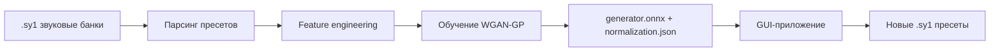

# Synth1GAN — Этот Synth1 банк не существует

Генерирует новые пресеты VST-синтезатора [Synth1](https://daichilab.sakura.ne.jp/softsynth/) с помощью нейросети **WGAN-GP**, обученной на реальных банках звуков.

<div class="grid cards" markdown>

-   :material-download: **Скачать**

    ---

    Установите приложение для вашей платформы:

    [Windows](https://github.com/seechov/synth1-patch-generator/releases/latest){ .md-button }
    [macOS](https://github.com/seechov/synth1-patch-generator/releases/latest){ .md-button }
    [Linux (.deb / .rpm)](https://github.com/seechov/synth1-patch-generator/releases/latest){ .md-button }

-   :material-book-open-page-variant: **Документация**

    ---

    Прочитайте [обзор](ru/overview.md) или перейдите сразу к
    [обучению своей модели](overview.md#41).

-   :material-console: **Сборка из исходников**

    ---

    Часть [обучения](https://github.com/seechov/synth1-patch-generator/tree/main/training) — Python 3.12 / PyTorch, а
    [GUI](https://github.com/seechov/synth1-patch-generator/tree/main/gui) — Rust / egui / tract-onnx.

</div>

---

## Что такое Synth1GAN?

Synth1GAN генерирует новые, ранее не существовавшие пресеты (`.sy1`) для бесплатного VST-синтезатора **Synth1**. Это Wasserstein GAN с градиентным штрафом (WGAN-GP), обученный на фабричном банке, бесплатных банках звуков или любой их комбинации. Код обучения основан на оригинальном проекте [jskripchuk/Synth1GAN](https://github.com/jskripchuk/Synth1GAN) (GPL-3.0).

Полный пайплайн:



---

## Быстрый старт

### Генерация пресетов

1. Скачайте и запустите приложение для вашей платформы.
2. При первом запуске модель по умолчанию загружается автоматически — вы увидите зелёный индикатор **● model ready**.
3. Выберите **Output folder** (по умолчанию `Documents/Synth1GAN/presets`).
4. Задайте имя банка и количество пресетов (1–128).
5. Нажмите **⚡ Generate**.
6. Загрузите выходную папку в Synth1 через **File → Load Bank**.

### Обучение своей модели

```powershell
# GPU (CUDA 12.1) — рекомендуется
pip install torch torchvision --index-url https://download.pytorch.org/whl/cu121

pip install -r training/requirements.txt
python training/train.py --presets-dir C:\path\to\presets --output-dir .\model
```

> Настоятельно рекомендуется GPU (~8 ч на GTX 1070, ~30 мин на RTX 3080). Обучение поддерживается на Python 3.12.

Подробности — в [обзоре](ru/overview.md).
