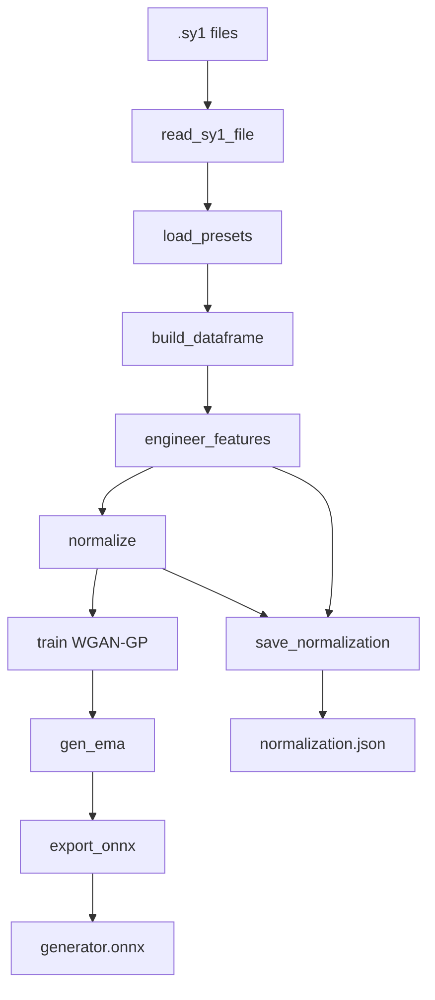

# `train.py` Walkthrough — Seechov Forge

> The training code is derived from the original [jskripchuk/Synth1GAN](https://github.com/jskripchuk/Synth1GAN) project, licensed under **GPL-3.0**.

> This document explains the training script section by section.  
> It is written for readers who are comfortable with Python programming but
> have never worked with neural network training.  
> Each section includes a brief explanation of the underlying concept and
> links to articles for deeper study.

> **Note:** this document describes the *current* behavior of `train.py`.
> It is organized by function/concern rather than by exact line numbers, so it
> stays accurate across small refactors.

---

## Table of Contents

1. [What This Script Does — the Big Picture](#1-what-this-script-does--the-big-picture)
2. [Imports and Dependencies](#2-imports-and-dependencies)
3. [Synth1 Parameter Definitions](#3-synth1-parameter-definitions)
4. [Reading Preset Files](#4-reading-preset-files)
5. [Building the DataFrame](#5-building-the-dataframe)
6. [Feature Engineering](#6-feature-engineering)
7. [Data Normalization](#7-data-normalization)
8. [Neural Network Architecture](#8-neural-network-architecture)
9. [Gradient Penalty](#9-gradient-penalty)
10. [The Training Loop](#10-the-training-loop)
11. [ONNX Export](#11-onnx-export)
12. [Saving Normalization Metadata](#12-saving-normalization-metadata)
13. [Entry Point `main()`](#13-entry-point-main)
14. [Full Data Flow Diagram](#14-full-data-flow-diagram)
15. [Key Concepts for Further Study](#15-key-concepts-for-further-study)

---

## 1. What This Script Does — the Big Picture

`train.py` is a single-file, end-to-end trainer. It takes a folder of Synth1
presets (`.sy1` files), turns them into a tabular dataset, and trains a
Wasserstein GAN with Gradient Penalty (WGAN-GP) to generate *new* presets.

In order, the script:

1. Recursively scans `--presets-dir` for `*.sy1` files.
2. Parses each preset into a dictionary.
3. Builds a `pandas.DataFrame`, renames parameter IDs to human-readable names,
   and one-hot encodes categorical parameters.
4. Normalizes continuous features to `[-1, 1]` (one-hot columns stay `0/1`).
5. Trains a WGAN-GP.
6. Exports the generator to `generator.onnx`.
7. Saves `normalization.json` (the metadata the GUI needs to reconstruct
   real parameter values from the model output).

---

## 2. Imports and Dependencies

The script uses:

- **Python standard library** — `argparse` (CLI), `glob`/`os` (file scanning),
  `json` (metadata), `random` (seeding), `copy` (EMA), `csv`, `sys`.
- **NumPy / pandas** — tabular data handling.
- **PyTorch** (`torch`, `torch.nn`, `torch.autograd`, `torch.utils.data`) — the
  neural network and training machinery.
- **scikit-learn** — `OneHotEncoder` for categorical features.

`torch.autograd.Variable` and `csv` are imported but effectively vestigial;
they are harmless leftovers.

---

## 3. Synth1 Parameter Definitions

Three module-level constants define how Synth1 presets map to features.

### `COL_RENAME`

Maps numeric Synth1 parameter IDs (`0`–`74`) to human-readable names, e.g.
`0 → "osc1 shape"`, `19 → "filter freq"`, `43 → "lfo1 speed"`. The `.sy1` files
store parameters by numeric ID; `COL_RENAME` is what turns those IDs into
meaningful column names (and back, via `save_normalization`).

### `TO_DROP`

A list of columns deliberately excluded from training because they are too
noisy or sparse to be useful: the arpeggiator parameters, the equalizer, pitch
bend range, name, and a few oscillator detune/key-track parameters. Dropping
these reduces the feature space and removes mostly-constant columns that would
add noise without signal.

### `CATEGORICAL_VARS`

The list of parameters treated as *categorical* (discrete choices) rather than
continuous: oscillator shapes, filter/chorus/play-mode types, LFO destinations
and types, and the mod-envelope destination. These are one-hot encoded.

---

## 4. Reading Preset Files

### `read_sy1_file(filepath)`

Parses a single `.sy1` file:

- The first three lines are a header: `name`, `color=…`, `ver=…`.
- Every following line is `param_id,value`.

It returns a dictionary, or `None` if the file is invalid (fewer than 4 lines,
or an exception). Reading uses `errors="ignore"` so slightly malformed files
don't crash the whole run.

### `load_presets(presets_dir)`

Uses `glob` to find `*.sy1` files recursively (both nested and flat layouts),
deduplicates the path list, parses each file with `read_sy1_file`, and returns
the list of successfully parsed preset dictionaries.

---

## 5. Building the DataFrame

### `build_dataframe(presets)`

Turns the list of parsed dictionaries into a `pandas.DataFrame`:

1. Drops columns where the majority of presets have no value (mostly-empty
   parameters).
2. Renames numeric parameter-ID columns to their human-readable names using
   `COL_RENAME`.

---

## 6. Feature Engineering

### `engineer_features(df)`

Prepares the raw DataFrame for training and reports how much data it dropped.
It returns `(df, cat_vars, encoders, one_hot_cols)`:

- `df` — the numeric, one-hot encoded feature matrix.
- `cat_vars` — `{categorical_name: number_of_classes}`.
- `encoders` — `{categorical_name: OneHotEncoder}` (needed to round-trip values).
- `one_hot_cols` — the set of generated one-hot column names (e.g. `"filter type-0"`).

Steps:

1. **Drop metadata/noise** — removes `TO_DROP` columns and `color`/`ver`/`pack`.
2. **Coerce to numeric** — `pd.to_numeric(..., errors="coerce")`.
3. **Drop sparse columns** — removes columns where ≥20% of values are missing,
   then median-fills the rest.
4. **One-hot encode** each categorical variable in `CATEGORICAL_VARS` (skipping
   any with fewer than 2 unique values). Each encoded set becomes columns named
   `"{name}-{i}"`.
5. **Drop duplicate rows.**

The function prints how many input rows/columns there were, how many
metadata/noise columns and sparse columns were dropped, how many duplicate rows
were removed, and the final feature count — so data-loss is visible rather than
silent.

---

## 7. Data Normalization

### `normalize(df, one_hot_cols)`

Scales **only continuous** columns to `[-1, 1]` using min-max scaling:

```
scaled = 2.0 * ((x - min) / (max - min)) - 1.0
```

One-hot columns are left at `0/1`. This is the key change that lets the
generator use a `tanh` head for continuous outputs (which is naturally bounded
to `[-1, 1]`) and a `softmax` head for each categorical output (which naturally
emits probabilities summing to 1).

It returns `(df_out, min_vals, max_vals)`. `min_vals`/`max_vals` are `None` if
there are no continuous columns (unlikely in practice).

---

## 8. Neural Network Architecture

### `Generator(latent_dim, n_cont, group_sizes, batch_norm)`

The generator maps a noise vector to a complete preset. It has:

- **A shared trunk** — a stack of `Linear` → optional `BatchNorm` → `LeakyReLU(0.2)`
  layers (`latent_dim → 128 → 256 → 512 → 1024`).
- **A continuous head** — `Linear(1024, n_cont)` followed by `tanh`, producing
  the continuous feature values in `[-1, 1]`.
- **Categorical heads** — one `Linear(1024, n_classes)` per categorical
  variable, each followed by `softmax`, producing a probability distribution
  over that variable's classes.

In `forward`, the trunk output is fed to both head groups, and the parts are
concatenated: continuous features first, then the one-hot groups. This split
lets each categorical variable be generated as a clean distribution (instead of
a single `tanh` output that would have to be thresholded later).

`batch_norm` toggles BatchNorm in the hidden trunk layers.

> **Concept — output heads.** A single `tanh` output forced both continuous and
> categorical features through the same bounded nonlinearity. Splitting into
> heads matches the activation to the feature type: `tanh` for unbounded-but-
> scaled continuous values, `softmax` for mutually-exclusive categories.

### `Discriminator(data_size, use_spectral_norm)`

The discriminator (or "critic", in WGAN terms) maps a preset vector to a single
real-valued score (higher = more realistic). It is an MLP:

```
Linear(F) → LeakyReLU → Linear(256→128) → LeakyReLU → Linear(128→64) → LeakyReLU → Linear(64→1)
```

With `use_spectral_norm=True`, every linear layer is wrapped in
[spectral normalization](https://arxiv.org/abs/1802.05957), which constrains the
discriminator's Lipschitz constant and can stabilize training further (on top of
the gradient penalty).

> **Concept — WGAN critic.** In a WGAN the discriminator estimates the
> Wasserstein distance rather than classifying real vs. fake, so its output is a
> real number, not a probability, and there is no sigmoid on the last layer.

### `PresetDataset(df)`

A thin `torch.utils.data.Dataset` wrapper around the normalized DataFrame. It
converts the values to `float32` once and serves rows as tensors.

---

## 9. Gradient Penalty

### `compute_gradient_penalty(D, real, fake, device)`

Implements the WGAN-GP gradient penalty. It:

1. Samples random points `interpolates` along lines between `real` and `fake`
   (`alpha * real + (1 - alpha) * fake`).
2. Computes the gradient of the critic's output w.r.t. those points.
3. Penalizes any deviation of the gradient norm from 1:

```
penalty = mean((||grad||₂ − 1)²)
```

This enforces the 1-Lipschitz constraint that the Wasserstein distance requires,
without the weight clipping of the original WGAN.

---

## 10. The Training Loop

### `train(...)`

This is the heart of the script. Its relevant parameters are:

| Parameter | Meaning |
|-----------|---------|
| `df_norm` | normalized feature DataFrame |
| `n_epochs`, `batch_size`, `latent_dim` | training length, batch size, noise dim |
| `lr_g`, `lr_d` | separate learning rates for generator and discriminator |
| `n_critic` | critic updates per generator update |
| `lambda_gp` | gradient-penalty weight |
| `one_hot_cols`, `cat_vars` | structural metadata for building the generator |
| `batch_norm` | toggles BatchNorm in the generator trunk |
| `ema_decay` | EMA decay for generator weights (`None` disables) |
| `spectral_norm` | toggles spectral normalization in the critic |
| `d_noise_std` | std of Gaussian noise added to critic inputs |

The function:

1. **Orders features** — continuous columns first, then one-hot groups, and
   builds the generator with the right head sizes.
2. **Clamps the batch size** — if `batch_size > dataset size`, it uses
   `max(1, len // 4)` and warns. This prevents `drop_last=True` from silently
   skipping every batch.
3. **Creates models** — generator and discriminator, moved to CUDA if available.
4. **Creates the EMA copy** — if `ema_decay` is not `None`, a deep copy of the
   generator is kept in `eval()` mode with frozen gradients.
5. **Creates optimizers** — separate Adam optimizers for G and D (each with
   `betas=(0.5, 0.999)`, a standard GAN choice).
6. **Trains** — for each epoch and batch:

   **Discriminator step** — sample noise, generate fakes (detached), optionally
   add Gaussian noise to both real and fake inputs, then minimize:

   ```
   D_loss = -mean(D(real)) + mean(D(fake)) + λ · GP
   ```

   **Generator step** (every `n_critic` batches) — sample noise, generate
   fakes, and minimize:

   ```
   G_loss = -mean(D(G(z)))
   ```

   After each generator step, the EMA weights are updated:

   ```
   ema_w = decay · ema_w + (1 - decay) · w
   ```

   **Diversity diagnostic** — every `sample_interval` generator steps it prints,
   alongside the losses, two heuristic metrics computed on the CPU:

   - `min-nn` — mean minimal L2 distance from each generated preset to the
     nearest real preset (very low → mode collapse).
   - `pw` — mean pairwise distance among the generated batch (very low → lack
     of diversity).

7. **Checkpoints** — every 500 epochs it saves the generator `state_dict`
   (plus `ema_state_dict` if EMA is enabled) and structural metadata.

It returns `(generator, gen_ema)`.

---

## 11. ONNX Export

### `export_onnx(generator, latent_dim, output_dir, filename)`

Puts the generator in `eval()` mode and exports it to ONNX (`opset_version=13`),
with a dummy input of shape `(1, latent_dim)`. The input is named `noise`, the
output `preset`, and both have a dynamic batch dimension. In `main`, the EMA
generator is exported when available (it is more stable than the last training
step).

---

## 12. Saving Normalization Metadata

### `save_normalization(...)`

Writes `normalization.json`, which the GUI uses to turn the generator's raw
output back into real Synth1 parameter values. It records two maps:

- **`continuous_stats`** — for each continuous column: its column index in the
  output vector, its `min`/`max` (for denormalization from `[-1, 1]`), and its
  numeric `param_id`.
- **`categorical_encodings`** — for each categorical variable: the `start_idx`
  of its one-hot slice, `num_classes`, the ordered `categories` (so the GUI can
  map the `argmax` index back to a value), and its `param_id`.

It also stores `latent_dim`, `output_dim`, and `column_names`.

Because continuous columns are ordered first and one-hot groups are appended in
`CATEGORICAL_VARS` order, the `start_idx` for each categorical group is simply
its position in the full output vector.

---

## 13. Entry Point `main()`

`main()` wires everything together and defines the CLI. The arguments are:

| Argument | Default | Purpose |
|----------|---------|---------|
| `--presets-dir` | *(required)* | Folder containing `.sy1` files (searched recursively) |
| `--output-dir` | `./model` | Output directory |
| `--epochs` | 20000 | Number of epochs |
| `--batch-size` | 64 | Mini-batch size (auto-clamped to the dataset) |
| `--latent-dim` | 32 | Noise vector size |
| `--lr-g` | 0.0002 | Generator learning rate |
| `--lr-d` | 0.0002 | Discriminator learning rate |
| `--n-critic` | 5 | Critic updates per generator update |
| `--lambda-gp` | 10.0 | Gradient penalty weight |
| `--sample-interval` | 400 | Log every N batches |
| `--batch-norm` | on | BatchNorm in the generator trunk (`--no-batch-norm` disables) |
| `--ema-decay` | 0.999 | EMA decay for generator weights (`0` disables) |
| `--spectral-norm` | off | Spectral normalization in the discriminator |
| `--d-noise-std` | 0.0 | Std of Gaussian noise added to critic inputs |
| `--seed` | — | Random seed for reproducibility |

Execution order:

1. Parse arguments; if `--seed` is set, seed `random`, `numpy`, and `torch`.
2. Load presets (`load_presets`); abort if there are fewer than `batch_size`.
3. Build the DataFrame (`build_dataframe`).
4. Feature engineering (`engineer_features`).
5. Normalize (`normalize`).
6. Train (`train`) — returns the generator and its EMA copy.
7. Export the EMA generator to ONNX (`export_onnx`) and save metadata
   (`save_normalization`).

---

## 14. Full Data Flow Diagram



---

## 15. Key Concepts for Further Study

- **WGAN-GP** — [Improved Training of Wasserstein GANs](https://arxiv.org/abs/1704.00028)
- **Spectral normalization** — [Spectral Normalization for GANs](https://arxiv.org/abs/1802.05957)
- **Exponential moving average of weights** — [EMA of weights in GANs (SWA/EMA)](https://arxiv.org/abs/1806.04434), standard in Stable Diffusion and DCGAN-style runs.
- **One-hot encoding** — [scikit-learn `OneHotEncoder` docs](https://scikit-learn.org/stable/modules/generated/sklearn.preprocessing.OneHotEncoder.html)
- **Adam optimizer** — [Adam: A Method for Stochastic Optimization](https://arxiv.org/abs/1412.6980)
