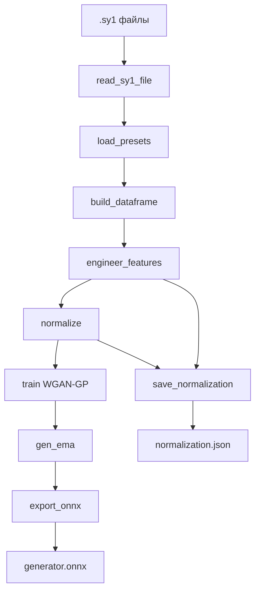

# Разбор скрипта `train.py` — Synth1GAN

> Этот документ объясняет обучающий скрипт по разделам.  
> Он рассчитан на читателя, который уверенно владеет Python, но никогда не
> работал с обучением нейросетей.  
> В каждом разделе — краткое объяснение концепции и ссылки на материалы для
> углублённого изучения.

> **Примечание:** документ описывает *текущее* поведение `train.py` и
> организован по функциям/концепциям, а не по точным номерам строк, поэтому
> остаётся актуальным при небольших рефакторингах.

---

## Содержание

1. [Что делает скрипт в целом](#1-что-делает-скрипт-в-целом)
2. [Импорты и зависимости](#2-импорты-и-зависимости)
3. [Определения параметров Synth1](#3-определения-параметров-synth1)
4. [Чтение файлов пресетов](#4-чтение-файлов-пресетов)
5. [Построение датафрейма](#5-построение-датафрейма)
6. [Инженерия признаков](#6-инженерия-признаков)
7. [Нормализация данных](#7-нормализация-данных)
8. [Архитектура нейросети](#8-архитектура-нейросети)
9. [Штраф на градиент](#9-штраф-на-градиент)
10. [Цикл обучения](#10-цикл-обучения)
11. [Экспорт в ONNX](#11-экспорт-в-onnx)
12. [Сохранение метаданных нормализации](#12-сохранение-метаданных-нормализации)
13. [Точка входа `main()`](#13-точка-входа-main)
14. [Итоговая схема потока данных](#14-итоговая-схема-потока-данных)
15. [Ключевые концепции для дальнейшего изучения](#15-ключевые-концепции-для-дальнейшего-изучения)

---

## 1. Что делает скрипт в целом

`train.py` — это монолитный скрипт полного цикла обучения. Он берёт папку с
пресетами Synth1 (файлы `.sy1`), превращает их в табличный датасет и обучает
Wasserstein GAN с градиентным штрафом (WGAN-GP) генерировать *новые* пресеты.

По порядку скрипт:

1. Рекурсивно ищет `*.sy1` файлы в `--presets-dir`.
2. Парсит каждый пресет в словарь.
3. Строит `pandas.DataFrame`, переименовывает числовые ID параметров в
   человекочитаемые имена и one-hot кодирует категориальные параметры.
4. Нормализует непрерывные признаки в `[-1, 1]` (one-hot остаются `0/1`).
5. Обучает WGAN-GP.
6. Экспортирует генератор в `generator.onnx`.
7. Сохраняет `normalization.json` (метаданные, нужные GUI для восстановления
   реальных значений параметров из выхода модели).

---

## 2. Импорты и зависимости

Скрипт использует:

- **Стандартную библиотеку Python** — `argparse` (CLI), `glob`/`os` (поиск
  файлов), `json` (метаданные), `random` (сид), `copy` (EMA), `csv`, `sys`.
- **NumPy / pandas** — работа с табличными данными.
- **PyTorch** (`torch`, `torch.nn`, `torch.autograd`, `torch.utils.data`) —
  нейросеть и цикл обучения.
- **scikit-learn** — `OneHotEncoder` для категориальных признаков.

`torch.autograd.Variable` и `csv` импортируются, но фактически не нужны — это
безобидные артефакты.

---

## 3. Определения параметров Synth1

Три константы на уровне модуля задают, как пресеты Synth1 превращаются в
признаки.

### `COL_RENAME`

Сопоставляет числовые ID параметров Synth1 (`0`–`74`) с человекочитаемыми
именами, например `0 → "osc1 shape"`, `19 → "filter freq"`, `43 → "lfo1 speed"`.
Файлы `.sy1` хранят параметры по числовым ID; `COL_RENAME` превращает эти ID в
осмысленные имена колонок (и обратно — через `save_normalization`).

### `TO_DROP`

Список колонок, намеренно исключённых из обучения, потому что они слишком
шумные или разреженные: параметры арпеджиатора, эквалайзер, pitch bend range,
имя, а также часть параметров отстройки/трекинга осцилляторов. Исключение
сокращает пространство признаков и убирает почти константные колонки, которые
добавляли бы шум без сигнала.

### `CATEGORICAL_VARS`

Список параметров, трактуемых как *категориальные* (дискретный выбор), а не
непрерывные: формы осцилляторов, типы фильтра/хоруса/режима игры, назначения и
типы LFO, и назначение mod-огибающей. Эти параметры one-hot кодируются.

---

## 4. Чтение файлов пресетов

### `read_sy1_file(filepath)`

Парсит один `.sy1` файл:

- Первые три строки — заголовок: `name`, `color=…`, `ver=…`.
- Каждая следующая строка — `param_id,value`.

Возвращает словарь или `None`, если файл некорректен (меньше 4 строк или
исключение). Чтение использует `errors="ignore"`, чтобы слегка повреждённые
файлы не ломали весь запуск.

### `load_presets(presets_dir)`

Использует `glob` для поиска `*.sy1` файлов (рекурсивно, поддерживает и
плоскую, и вложенную структуру), убирает дубликаты путей, парсит каждый файл и
возвращает список успешно разобранных пресетов.

---

## 5. Построение датафрейма

### `build_dataframe(presets)`

Превращает список разобранных словарей в `pandas.DataFrame`:

1. Убирает колонки, где у большинства пресетов нет значения (почти пустые
   параметры).
2. Переименовывает колонки с числовыми ID в человекочитаемые имена через
   `COL_RENAME`.

---

## 6. Инженерия признаков

### `engineer_features(df)`

Готовит сырой датафрейм к обучению и сообщает, сколько данных отброшено.
Возвращает `(df, cat_vars, encoders, one_hot_cols)`:

- `df` — числовая one-hot закодированная матрица признаков.
- `cat_vars` — `{имя_категории: число_классов}`.
- `encoders` — `{имя_категории: OneHotEncoder}` (нужен для обратного
  преобразования значений).
- `one_hot_cols` — множество имён сгенерированных one-hot колонок (например,
  `"filter type-0"`).

Шаги:

1. **Удаление метаданных/шума** — убирает колонки из `TO_DROP` и
   `color`/`ver`/`pack`.
2. **Приведение к числам** — `pd.to_numeric(..., errors="coerce")`.
3. **Удаление разреженных колонок** — убирает колонки, где ≥20% значений
   отсутствует, и заполняет оставшиеся пропуски медианой.
4. **One-hot кодирование** каждой категориальной переменной из
   `CATEGORICAL_VARS` (пропуская те, где меньше 2 уникальных значений). Каждый
   набор кодировок становится колонками вида `"{имя}-{i}"`.
5. **Удаление дубликатов строк.**

Функция печатает, сколько было исходных строк/колонок, сколько metadata/noise
и разреженных колонок отброшено, сколько удалено дубликатов и итоговое число
признаков — чтобы потери данных были видны, а не «молчаливы».

---

## 7. Нормализация данных

### `normalize(df, one_hot_cols)`

Масштабирует **только непрерывные** колонки в `[-1, 1]` через min-max
нормализацию:

```
scaled = 2.0 * ((x - min) / (max - min)) - 1.0
```

One-hot колонки остаются `0/1`. Это ключевое изменение: генератор использует
`tanh`-голову для непрерывных выходов (которая естественно ограничена `[-1, 1]`)
и `softmax`-голову на каждую категориальную переменную (которая выдаёт
вероятности, в сумме дающие 1).

Возвращает `(df_out, min_vals, max_vals)`. `min_vals`/`max_vals` равны `None`,
если непрерывных колонок нет (на практике маловероятно).

---

## 8. Архитектура нейросети

### `Generator(latent_dim, n_cont, group_sizes, batch_norm)`

Генератор превращает вектор шума в полный пресет. У него есть:

- **Общий ствол** — стек слоёв `Linear` → опциональный `BatchNorm` →
  `LeakyReLU(0.2)` (`latent_dim → 128 → 256 → 512 → 1024`).
- **Непрерывная голова** — `Linear(1024, n_cont)` с последующим `tanh`,
  выдающая непрерывные значения в `[-1, 1]`.
- **Категориальные головы** — по одному `Linear(1024, n_classes)` на
  категориальную переменную, каждый с `softmax`, выдающий распределение
  вероятностей по классам этой переменной.

В `forward` выход ствола подаётся в обе группы голов, и части конкатенируются:
сначала непрерывные признаки, затем one-hot группы. Такое разделение позволяет
генерировать каждую категориальную переменную как «чистое» распределение (а не
через единый `tanh`, который потом пришлось бы прореживать порогом).

`batch_norm` включает/выключает BatchNorm в скрытых слоях ствола.

> **Концепция — выходные головы.** Единый `tanh` заставлял и непрерывные, и
> категориальные признаки проходить через одну ограниченную нелинейность.
> Разделение на головы подбирает активацию под тип признака: `tanh` для
> масштабированных непрерывных значений, `softmax` для взаимоисключающих
> категорий.

### `Discriminator(data_size, use_spectral_norm)`

Дискриминатор (в терминах WGAN — «критик») превращает вектор пресета в одно
вещественное число (больше = реалистичнее). Это MLP:

```
Linear(F) → LeakyReLU → Linear(256→128) → LeakyReLU → Linear(128→64) → LeakyReLU → Linear(64→1)
```

При `use_spectral_norm=True` каждый линейный слой оборачивается в
[спектральную нормализацию](https://arxiv.org/abs/1802.05957), которая
ограничивает константу Липшица критика и может дополнительно стабилизировать
обучение (поверх градиентного штрафа).

> **Концепция — критик WGAN.** В WGAN дискриминатор оценивает расстояние
> Вассерштейна, а не классифицирует «реальный/фейк», поэтому его выход — это
> вещественное число, а не вероятность, и сигмоиды на последнем слое нет.

### `PresetDataset(df)`

Тонкая обёртка над `torch.utils.data.Dataset` для нормализованного датафрейма.
Конвертирует значения в `float32` один раз и выдаёт строки как тензоры.

---

## 9. Штраф на градиент

### `compute_gradient_penalty(D, real, fake, device)`

Реализует градиентный штраф WGAN-GP. Она:

1. Сэмплирует случайные точки `interpolates` на отрезках между `real` и
   `fake` (`alpha * real + (1 - alpha) * fake`).
2. Считает градиент выхода критика по этим точкам.
3. Штрафует отклонение нормы градиента от 1:

```
penalty = mean((||grad||₂ − 1)²)
```

Это накладывает ограничение 1-Липшица, необходимое для расстояния
Вассерштейна, без обрезки весов исходного WGAN.

---

## 10. Цикл обучения

### `train(...)`

Сердце скрипта. Ключевые параметры:

| Параметр | Смысл |
|----------|-------|
| `df_norm` | нормализованный датафрейм признаков |
| `n_epochs`, `batch_size`, `latent_dim` | длина обучения, размер батча, размерность шума |
| `lr_g`, `lr_d` | раздельные скорости обучения генератора и дискриминатора |
| `n_critic` | шагов критика на шаг генератора |
| `lambda_gp` | вес градиентного штрафа |
| `one_hot_cols`, `cat_vars` | структурные метаданные для построения генератора |
| `batch_norm` | включает BatchNorm в стволе генератора |
| `ema_decay` | коэффициент EMA весов генератора (`None` отключает) |
| `spectral_norm` | включает спектральную нормализацию критика |
| `d_noise_std` | СКО гауссова шума, добавляемого на входы критика |

Функция:

1. **Упорядочивает признаки** — сначала непрерывные колонки, затем one-hot
   группы, и строит генератор с правильными размерами голов.
2. **Ограничивает размер батча** — если `batch_size > размер датасета`,
   используется `max(1, len // 4)` с предупреждением. Это не даёт
   `drop_last=True` молча пропускать все батчи.
3. **Создаёт модели** — генератор и дискриминатор, переносит на CUDA, если
   доступна.
4. **Создаёт EMA-копию** — если `ema_decay` не `None`, глубокая копия
   генератора держится в режиме `eval()` с замороженными градиентами.
5. **Создаёт оптимизаторы** — раздельные Adam для G и D (у каждого
   `betas=(0.5, 0.999)` — стандартный выбор для GAN).
6. **Обучает** — по эпохам и батчам:

   **Шаг дискриминатора** — сэмплирует шум, генерирует фейки (отсоединённые),
   опционально добавляет гауссов шум к реальным и сгенерированным входам, и
   минимизирует:

   ```
   D_loss = -mean(D(real)) + mean(D(fake)) + λ · GP
   ```

   **Шаг генератора** (каждые `n_critic` батчей) — сэмплирует шум, генерирует
   фейки и минимизирует:

   ```
   G_loss = -mean(D(G(z)))
   ```

   После каждого шага генератора обновляются веса EMA:

   ```
   ema_w = decay · ema_w + (1 - decay) · w
   ```

   **Диагностика разнообразия** — каждые `sample_interval` шагов генератора
   печатаются, помимо лоссов, две эвристические метрики, считаемые на CPU:

   - `min-nn` — среднее минимальное L2-расстояние от каждого сгенерированного
     пресета до ближайшего реального (очень низкое → mode collapse).
   - `pw` — среднее попарное расстояние среди сгенерированного батча (очень
     низкое → нехватка разнообразия).

7. **Чекпоинты** — каждые 500 эпох сохраняет `state_dict` генератора (плюс
   `ema_state_dict`, если EMA включена) и структурные метаданные.

Возвращает `(generator, gen_ema)`.

---

## 11. Экспорт в ONNX

### `export_onnx(generator, latent_dim, output_dir, filename)`

Переводит генератор в режим `eval()` и экспортирует в ONNX
(`opset_version=13`) с фиктивным входом формы `(1, latent_dim)`. Вход называется
`noise`, выход — `preset`, у обоих динамическая размерность батча. В `main`
экспортируется EMA-генератор, если он доступен (он стабильнее последнего шага
обучения).

---

## 12. Сохранение метаданных нормализации

### `save_normalization(...)`

Записывает `normalization.json`, который GUI использует, чтобы превратить
сырой выход генератора обратно в реальные значения параметров Synth1. Хранит
две карты:

- **`continuous_stats`** — для каждой непрерывной колонки: её индекс в векторе
  выхода, `min`/`max` (для денормализации из `[-1, 1]`) и числовой `param_id`.
- **`categorical_encodings`** — для каждой категориальной переменной:
  `start_idx` её one-hot слайса, `num_classes`, упорядоченные `categories`
  (чтобы GUI мог отобразить индекс `argmax` обратно в значение) и `param_id`.

Также хранит `latent_dim`, `output_dim` и `column_names`.

Так как непрерывные колонки идут первыми, а one-hot группы добавляются в
порядке `CATEGORICAL_VARS`, `start_idx` каждой категориальной группы — это
просто её позиция в полном векторе выхода.

---

## 13. Точка входа `main()`

`main()` связывает всё воедино и определяет CLI. Аргументы:

| Аргумент | По умолчанию | Смысл |
|----------|--------------|-------|
| `--presets-dir` | *(обязательный)* | Папка с `.sy1` файлами (ищется рекурсивно) |
| `--output-dir` | `./model` | Выходная директория |
| `--epochs` | 20000 | Число эпох |
| `--batch-size` | 64 | Размер мини-выборки (автоматически ограничивается датасетом) |
| `--latent-dim` | 32 | Размер вектора шума |
| `--lr-g` | 0.0002 | Скорость обучения генератора |
| `--lr-d` | 0.0002 | Скорость обучения дискриминатора |
| `--n-critic` | 5 | Шагов критика на шаг генератора |
| `--lambda-gp` | 10.0 | Вес градиентного штрафа |
| `--sample-interval` | 400 | Как часто печатать лог |
| `--batch-norm` | вкл | BatchNorm в стволе генератора (`--no-batch-norm` отключает) |
| `--ema-decay` | 0.999 | Коэффициент EMA весов генератора (`0` отключает) |
| `--spectral-norm` | выкл | Спектральная нормализация дискриминатора |
| `--d-noise-std` | 0.0 | СКО гауссова шума на входах критика |
| `--seed` | — | Сид для воспроизводимости |

Порядок выполнения:

1. Разбор аргументов; если задан `--seed`, инициализирует `random`, `numpy` и
   `torch`.
2. Загрузка пресетов (`load_presets`); прерывается, если их меньше `batch_size`.
3. Построение датафрейма (`build_dataframe`).
4. Инженерия признаков (`engineer_features`).
5. Нормализация (`normalize`).
6. Обучение (`train`) — возвращает генератор и его EMA-копию.
7. Экспорт EMA-генератора в ONNX (`export_onnx`) и сохранение метаданных
   (`save_normalization`).

---

## 14. Итоговая схема потока данных



---

## 15. Ключевые концепции для дальнейшего изучения

- **WGAN-GP** — [Improved Training of Wasserstein GANs](https://arxiv.org/abs/1704.00028)
- **Спектральная нормализация** — [Spectral Normalization for GANs](https://arxiv.org/abs/1802.05957)
- **Экспоненциальное скользящее среднее весов (EMA)** — [EMA of weights (SWA/EMA)](https://arxiv.org/abs/1806.04434), стандарт в Stable Diffusion и подходах в духе DCGAN.
- **One-hot кодирование** — [документация `OneHotEncoder`](https://scikit-learn.org/stable/modules/generated/sklearn.preprocessing.OneHotEncoder.html)
- **Оптимизатор Adam** — [Adam: A Method for Stochastic Optimization](https://arxiv.org/abs/1412.6980)
